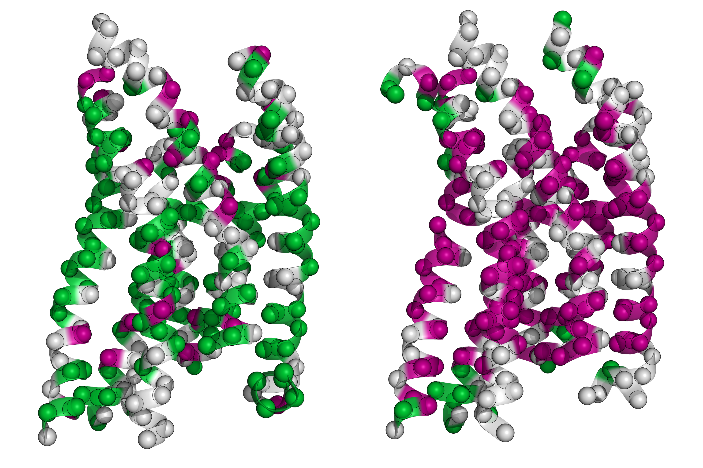

# GPCRs

G protein-coupled receptors (GPCRs) are one of the most important drug targets including therapeutic monoclonal antibodies. Despite importance for clinics, spending enormous R&D costs and decades efforts, very few therapeutic monoclonal antibodies have been approved for clinical uses. This is largely due to not only the difficulties of membrane protein expression, purification and stabilization of GPCRs, but also subsequent monoclonal antibody binding assays. Here we describe:

